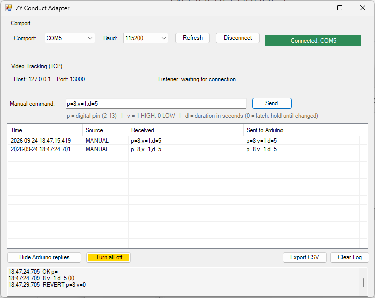
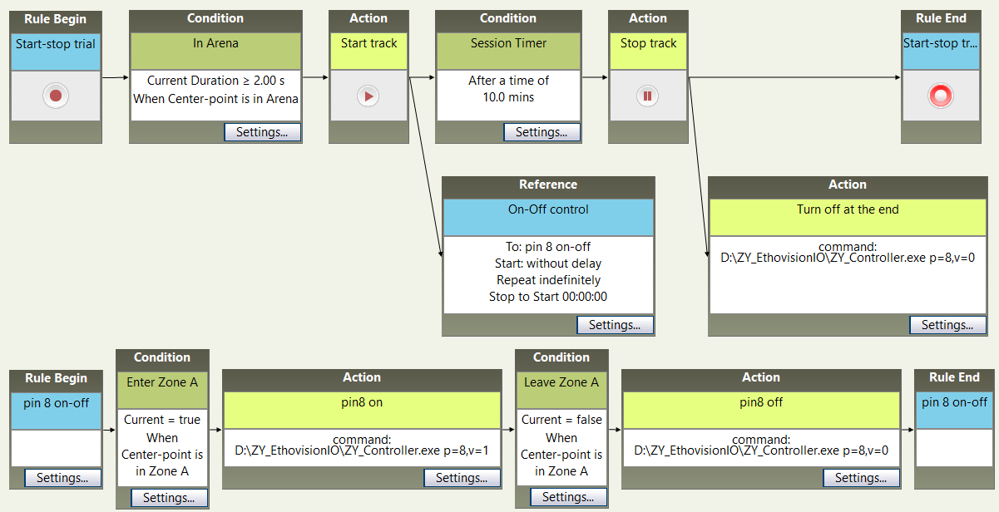

<h1 align="center">SOP for ZY_PinBridge</h1>
<p align="center">
  EthoVision-controlled Arduino I/O for a single behavioral chamber
</p>

> [!NOTE]
> **Update 2026-09-25:** Change software name from `ZY_EthovisionIO` to `ZY_PinBridge`.

<p align="center">
  <br>
  <em>ZY_PinBridge_UI</em>
</p>

## One-Time Setup

### 1. Flash the Arduino Firmware

* Open `ZY_EthovisionIO.ino` in the **Arduino IDE**.
* Flash the firmware to an **Arduino Uno R3**.

### 2. Optional: Test the Arduino

* Open the **Serial Monitor** in the Arduino IDE.
* Test the connection by manually sending:

```text
p=13,v=1,d=5
```

* Confirm that the command works correctly. The built-in **Pin 13 LED** on the Arduino Uno R3 should turn on for 5 seconds.
* **Close the Serial Monitor after testing** so the COM port is available to `ZY_AdapterUI.exe`.

### 3. Optional: Rebuild the Executable Files

> This step is only required if you want to modify the `.cs` source code and re-compile it.

* Run:

```text
build_UI.bat
```

* This will recompile the `.exe` files.

---

## Experimental Procedure

### 1. Connect the Arduino

* Connect the Arduino to the PC via USB.
* Open **Device Manager** and identify the Arduino's COM port.

### 2. Start ZY_PinBridge_UI

* Launch `ZY_PinBridge_UI.exe`.
* Select the correct COM port and connect.
* Leave `ZY_PinBridge_UI` running throughout the experiment.
* ~~Wait approximately **10 seconds** before starting EthoVision~~ 

~~You can verify that the connection is ready by testing:~~

~~```text~~
~~p=13,v=1,d=5~~
~~```~~

~~The built-in Pin 13 LED should turn on for 5 seconds.~~

> [!NOTE]
> **Update 2026-09-25:** You no longer need to wait after `Connected` is displayed.

### 3. Configure EthoVision

In EthoVision:

1. Create an **External Command Action**.
2. Set **Select program to run** to:

```text
ZY_PinBridge_Controller.exe
```

3. Enter the desired command under **Command line options**.

#### Examples
<p align="center">
  <br>
  <em>EthoVision Trial Control setup</em>
</p>
Turn Pin 8 ON:

```text
p=8,v=1
```

Turn Pin 8 ON for 30 seconds:

```text
p=8,v=1,d=30.00
```
Turn Pin 8 OFF:

```text
p=8,v=0
```
Command format:

```text
p=<pin>,v=<value>,d=<duration>
```

where:

* `p` = Arduino pin number
* `v` = output value (`1` = ON, `0` = OFF)
* `d` = optional duration in seconds for ON phase

### 4. Run the Experiment

* Start the experiment in **EthoVision**.
* Keep `ZY_PinBridge_UI` running throughout the session.
* Monitor the **exportable log in ZY_PinBridge_UI** to confirm that commands are being received and executed correctly.

---

## Shutdown

1. Finish or stop the EthoVision experiment.
2. Close `ZY_PinBridge_UI`.
3. Disconnect the Arduino if needed.


<p align="center">
  Copyright © 2026 Zengyou Ye · <a href="LICENSE">MIT License</a>
</p>
